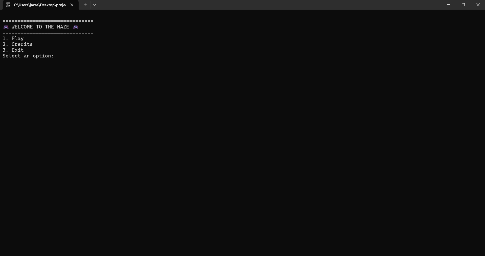

[](https://classroom.github.com/a/mi1WNrHU)
# Proyecto de C++ - Brain Labyrinth

## Descripción del Proyecto
El proyecto consiste en un juego del tipo puzzle, en donde el jugador tiene la oportunidad de resolver distintos laberintos que se le son presentados, contando con 3 dificultades y variedad de mapas, utilizando estructuras como `switch` para los menus, `for` para poder visualizar los mapas e `if` y `else` para controlar el movimiento todo esto formando nuestro codigo para brindar una experiencia de puzzles divertida a los jugadores.

- Temática y ambientación
   Cada laberinto tiene una tematica y ambientacion diferente para que no se sienta monotona la experiencia.

- Mecánica principal
   El usuario puede moverse por el laberinto tomando los coleccionables que se encuentran esparcidos por todo el mapa al mismo tiempo que busca la salida para pasar al siguiente nivel.

- Idea general de la jugabilidad
   El jugador tiene 4 maneras de moverse por el mapa (W - Arriba, A - Izquierda, S - Abajo, D - Derecha) las cuales tiene que digitar desde su teclado, moviendose por los caminos permitidos del mapa, y al llegar a la meta acaba el mapa.

- Aplicación de los temas vistos (uno por uno con ejemplos)
   - Variables y tipos de datos
      Se ha utilizado bool para saber si el juego a o no acabado, y void para funciones que no necesiten se les introduzca algun dato (como mapas o movimiento).

   - Estructuras condicionales (if, else, switch)
      If ha sido utilizado para asegurar si el jugador puede moverse en la casilla seleccionada./
      Else ha sido utilizado para en caso de no poder moverse a la casilla avise al jugador./
      Switch ha sido utilizado para seleccionar dificultad, y el mapa a jugar.

   - Ciclos (for, while, do while)
      For ha sido utilizado para mostrar los mapas de los laberintos en consola./
      While ha sido utilizado para que mientras el jugador no decida salir del juego, al acabar un mapa regresara a la interfaz principal.
      
   - Funciones
      Se han utilizado funciones para realizar los mapas, movimiento e interfaz a utilizar en librerias y que solo sean llamados en el main.

   
   - Estructuras de datos

     Se emplearon arreglos dinámicos para representar cada laberinto de manera flexible.
   
   - Manejo de archivos

   - Manejo de errores


     Se controla que el jugador no pueda salirse de los limites del laberinto.
     

   - Interfaz por consola


     Todo el juego se ejecuta en consola, utilizando salidas de texto y emojis para representar personajes, muros y caminos.

   - Consideraciones técnicas del desarrollo
     - Se ha utilizado la libreria vector para facilitar el movimiento a traves de los laberintos.
     - Se organizaron los laberintos en funciones separadas para modularidad del codigo.
      
- Imágenes o mockups del juego
   
   
   
   
   
   
## Equipo

- **Nombre del equipo:** Mind Overclocking

### Integrantes del equipo

1. **Nombre completo:** Dennis Alexander Fuentes Hernandez  
   **Carnet:** 00144625

2. **Nombre completo:** Diana Abigail Castillo Ramos
   **Carnet:** 00036625

3. **Nombre completo:** Diego Armando Guzman Soriano
   **Carnet:** 00188625

4. **Nombre completo:** Reynaldo Alexander Avelar Linares 
   **Carnet:** 00125625


## Instrucciones de Ejecución

1. Abre una terminal en tu Escritorio y clona este repositorio en tu máquina local:
   ```bash
   git clone [https://github.com/FDP-01-2025/project-mind-overclocking.git]
2. Cuando ya tengas lista tu carpeta dirigite al .exe de nombre Game.exe
3. Da click y se abrira una pestaña emergente con el juego.
4. Disfruta de tu experiencia!

## Flujogramas


